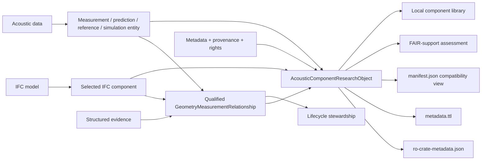

# Acoustic Component Research Object Prototype

> A prototype FAIR-oriented acoustic component research-object profile and workflow for IFC-linked measurement datasets, with qualified relationship evidence and lifecycle stewardship.

## 1. Project title

**Acoustic Component Research Object Prototype**

This repository implements a research prototype for representing one selected IFC building component together with acoustic data, structured metadata, an explicit geometry-measurement relationship, evidence supporting that relationship, FAIR-support evaluation, and lifecycle stewardship.

## 2. Research problem

Measured or predicted building-acoustic data are difficult to reuse responsibly when component identity, geometry, measurement context, provenance, rights, access conditions, versions, and the rationale for linking a result to a building component are scattered across different files and systems.

The prototype addresses that coordination problem. It does **not** claim to invent FAIR principles, research objects, RO-Crate, IFC-to-acoustic linking, BIM-acoustic workflows, IDS, bSDD, a universal acoustic metadata standard, a certified FAIR assessment method, or a new acoustic simulation method.

## 3. Literature-aware positioning

The project uses established concepts in complementary roles:

- **FAIR principles** provide high-level stewardship goals and an evaluation lens.
- **RO-Crate / research-object principles** provide the generic portable packaging baseline.
- **IFC** provides building-component representation, semantics, geometry and identity.
- **Acoustic measurement/simulation files** contain observations, processed values, derived results, predictions, references or simulation outputs.
- **RDF / JSON-LD / Linked Data** provide machine-readable descriptions and qualified relationships.
- **IDS** may express IFC-side delivery requirements.
- **bSDD** may provide shared property semantics when real identifiers are available.
- **Lifecycle stewardship** assesses whether the declared geometry↔measurement relationship remains defensible as sources and versions change.

The narrower contribution is the integration of these concerns into a specialized prototype profile and workflow for the selected IFC/acoustic-data use case.

## 4. Research contribution

The prototype has four conceptual outputs:

1. **Prototype Acoustic Component Research-Object Profile**
2. **Use-case metadata profile**
3. **Qualified Geometry-Measurement Relationship Model**
4. **Lifecycle Stewardship and FAIR-Support Evaluation**

The central domain object is `AcousticComponentResearchObject`. `FairAcousticPackage` remains as a backward-compatible storage/API name.

## 5. Non-contributions

The repository does not claim to provide:

- an approved RO-Crate community profile;
- a universal acoustic ontology or metadata standard;
- FAIR certification;
- DOI or Handle minting;
- long-term repository preservation;
- a scientific acoustic-validity checker;
- a new simulation solver or acoustic calculation method;
- a complete IFC-to-RDF conversion;
- production access control or institutional repository infrastructure.

## 6. Architecture



The three information layers remain distinct:

### IFC component representation

IFC is the authoritative geometry/component source. The prototype extracts, where available:

- IFC schema;
- `GlobalId`;
- IFC entity type;
- name;
- type assignment;
- material/layer summary;
- total thickness or other derived dimensions;
- spatial context;
- source-model version;
- SHA-256 source fingerprint.

Metadata summarizes these values only to identify and resolve the relationship; it does not duplicate the complete IFC object.

### Acoustic data

The primary data asset can represent:

- raw measurement;
- processed measurement;
- derived result;
- reference value;
- manufacturer value;
- predicted value;
- simulation result;
- unknown origin.

These origins are explicitly distinguished. The application does not label every acoustic record as raw measurement data.

### Metadata

Metadata describe package identity, asset identity, measurement context, provenance, versions, rights/access, qualified relationship evidence, FAIR-support assessment and lifecycle review history.

## 7. Acoustic Component Research-Object Profile

The prototype profile identifier is:

```text
https://example.org/fair-acoustic/profile/acoustic-component-ro/0.1
```

This is a **prototype identifier**, not a registered standard or persistent community-profile identifier.

Profile entity types include:

- `AcousticComponentResearchObject`
- `IfcModel`
- `IfcComponent`
- `MeasurementDataset`
- `MeasurementActivity`
- `Instrument`
- `Person`
- `Organization`
- `MetadataRecord`
- `GeometryMeasurementRelationship`
- `EvidenceItem`
- `FairSupportAssessment`
- `LifecycleAssessment`
- `ReviewActivity`
- `SoftwareApplication`
- `Licence`
- `ExternalResource`

Detailed requirements are in `docs/acoustic_component_ro_profile.md`.

## 8. IFC role

IFC provides component identity, model semantics and geometry evidence. The current extractor uses IfcOpenShell and resolves supported `IfcElement` instances by `GlobalId`, retaining actual model-derived evidence when available.

The prototype does not convert the whole IFC model to RDF. Instead, it uses a lightweight identity/reference pattern in the research-object metadata.

## 9. Measurement role

Measurement and acoustic-result files remain independent scientific assets. The structural inspector supports XML, CSV, JSON, HDF5, VTK and text/data formats and preserves source bytes.

XML inspection uses `defusedxml` to avoid unsafe XML processing. Format inspection identifies structure and signal hints; it does not claim complete domain interpretation of arbitrary laboratory schemas.

## 10. Metadata role

The metadata profile groups fields into:

- package identification;
- IFC component identification;
- acoustic dataset identification;
- measurement context;
- provenance;
- access and rights;
- relationship stewardship;
- optional IDS/bSDD references.

Fields are classified as prototype required, conditionally required, recommended, optional, or not currently supported. Missing user metadata remain missing rather than being fabricated.

See `docs/metadata_profile.md`.

## 11. Qualified relationship model

The central domain-specific relationship is `GeometryMeasurementRelationship`.

Controlled relationship types are:

```text
measuredOn
a characterizes
```

The actual enumeration implemented by the prototype is:

```text
measuredOn
characterizes
derivedFromMeasurementOf
applicableToEquivalentAssembly
predictedFor
references
unknownRelationship
```

These types are deliberately not treated as equivalent. A physical `measuredOn` claim is semantically different from a prediction or a value transferred to an equivalent assembly.

Relationship records include subject/object identifiers, rationale, structured evidence, source versions, review fields, status, trigger history and decision history.

## 12. Relationship evidence

Evidence items can record, for example:

- specimen or report identifiers;
- IFC GlobalId evidence;
- assembly/material/thickness/dimension comparison;
- manufacturer/product evidence;
- project location;
- source-document references;
- manual expert approval;
- algorithmic candidate matching.

Statuses are:

```text
SUPPORTS
CONTRADICTS
MISSING
NOT_APPLICABLE
NOT_VERIFIED
REQUIRES_REVIEW
```

No pseudo-scientific numerical confidence score is generated. The system exposes transparent qualitative evidence instead.

See `docs/relationship_evidence_model.md`.

## 13. FAIR-support assessment

FAIR is implemented as a design and evaluation framework, not as the artifact itself.

The bounded prototype assessment records structured criterion results using:

```text
PASS
PARTIAL
FAIL
NOT_APPLICABLE
NOT_VERIFIED
MANUAL_REVIEW
```

Application-level readiness labels are:

```text
READY_FOR_PROTOTYPE_REUSE
PARTIALLY_READY
INSUFFICIENT_METADATA
ASSESSMENT_INCOMPLETE
```

These labels are **not FAIR certification**.

Selected checks cover Findable, Accessible, Interoperable and Reusable evidence such as explicit identifiers, indexed assets, component identity, URI syntax/reachability status, rights, JSON-LD/RDF parseability, units, provenance, measurement origin, method/instrument context, versions, relationship evidence, intended reuse and citation information.

A URI string alone is not treated as proof of accessibility. External reachability is reported as verified, failed, or not tested.

See `docs/fair_assessment_profile.md`.

## 14. Lifecycle stewardship

The existing lifecycle engines remain authoritative for relationship stewardship. The research-object layer wraps rather than replaces:

- `engine.py`
- root `models.py`
- `association_lifecycle.py`
- `lifecycle_engine/*`

Lifecycle states include:

```text
ACCEPTABLE
SEMANTICALLY_STALE
BROKEN
AMBIGUOUS
MULTIPLE_CANDIDATES
UNMATCHED
INVALID
MANUAL_REVIEW
```

User-facing `STALE` remains a compatibility alias for `SEMANTICALLY_STALE` where the existing interface uses it.

Reassessment triggers distinguish editorial, descriptive, access, provenance, component-semantic, measurement-content, relationship-target, profile and review changes. Harmless editorial changes are not automatically classified as semantic staleness.

See `docs/lifecycle_stewardship.md`.

## 15. Independent outcomes

Every research object carries three separate outcome concepts:

```text
FAIR support:          PARTIALLY_READY
Lifecycle stewardship: ACCEPTABLE
Acoustic suitability:  NOT_ASSESSED
```

or, for example:

```text
FAIR support:          READY_FOR_PROTOTYPE_REUSE
Lifecycle stewardship: SEMANTICALLY_STALE
Acoustic suitability:  MANUAL_REVIEW
```

FAIR-support metadata cannot establish acoustic scientific suitability, and lifecycle validity cannot establish FAIR readiness.

## 16. IDS and bSDD positioning

IDS and bSDD are complementary to FAIR:

- IFC represents component information;
- IDS may specify IFC delivery requirements;
- bSDD may identify shared property concepts;
- the research-object profile connects IFC to external acoustic data;
- FAIR guides discovery, access, interoperability, provenance, rights and reuse;
- lifecycle stewardship assesses the continuing relationship.

The builder exposes optional IDS specification/result and bSDD concept/property URI fields. It does not require live bSDD connectivity and does not fabricate bSDD URIs.

## 17. Package structure

New research-object exports use:

```text
package-root/
├── ro-crate-metadata.json
├── metadata.ttl
├── manifest.json
├── geometry/
│   └── <original-model.ifc>
├── measurements/
│   └── <original-acoustic-data.*>
├── simulation/
│   └── <optional simulation artefacts>
├── research/
│   └── <optional reproducibility artefacts>
├── reports/
│   ├── fair-assessment.json
│   ├── lifecycle-assessment.json
│   ├── relationship-evidence.json
│   └── package-validation.json
├── checksums/
│   └── sha256sums.txt
└── README.txt
```

### Metadata authority and synchronization

1. The **in-memory domain model** is authoritative during application execution.
2. `ro-crate-metadata.json` is the principal portable research-object representation.
3. `metadata.ttl` is the domain-specific RDF/provenance/stewardship serialization.
4. `manifest.json` is a simplified derived compatibility manifest.

All three portable outputs are regenerated from the same domain model by `fair_platform.export.finalize_package()`.

Legacy root-layout packaging remains available to preserve existing tests/integrations, but the research-object builder uses the structured layout above.

## 18. Component library

The Streamlit Component Library is a local prototype catalog. It supports:

- title/global-ID/IFC-type/component-type/measurement-type search;
- FAIR-support and lifecycle filters;
- package selection;
- relationship inspection;
- source/metadata inspection;
- RDF/JSON-LD exploration;
- assessment report inspection;
- ZIP download;
- local deletion;
- RDF catalog/SPARQL queries.

It is not a certified repository, does not issue DOIs and does not guarantee long-term preservation.

## 19. Streamlit workflow

The canonical application is `app.py` and exposes eight workspaces:

1. **Overview**
2. **Build Research Object**
3. **Component Library**
4. **Relationship Evidence**
5. **FAIR-Support Assessment**
6. **Lifecycle Stewardship**
7. **RDF/JSON-LD Explorer**
8. **Documentation**

The builder follows seven stages:

1. load and resolve IFC;
2. load/classify acoustic data;
3. create qualified relationship and evidence;
4. complete grouped metadata;
5. validate;
6. review missing/manual-review items and independent outcomes;
7. export and inspect the research object.

## 20. Installation and running

Python 3.11+ is recommended.

```bash
python -m venv .venv
```

Windows PowerShell:

```powershell
.\.venv\Scripts\Activate.ps1
python -m pip install -r requirements.txt
python -m streamlit run app.py
```

If port 8501 is occupied:

```powershell
python -m streamlit run app.py --server.port 8502
```

A custom local package repository can be configured with:

```text
FAIR_PACKAGE_STORE=/path/to/store
```

## 21. Testing

Run the complete repository suite:

```bash
python -m pytest -q
```

Compile/import checks:

```bash
python -m compileall fair_platform dashboard app.py
python -c "import fair_platform; import dashboard.ui.research_enhanced_app"
```

Streamlit headless smoke test and research-object export verification are also executed in CI.

Tests cover legacy behavior plus research-object serialization, RO-Crate JSON-LD, RDF/Turtle parsing, manifests, checksums, ZIP layout/path safety, measurement classification, qualified relationships/evidence, trigger detection, bounded FAIR-support states, independent FAIR/lifecycle outcomes, catalog search, package validation and backward compatibility.

## 22. Research questions

The implementation is organized around:

**RQ1.** How can an IFC component and an external acoustic measurement dataset be represented as entities within a coherent acoustic component research object?

**RQ2.** Which identification, provenance, access, rights, measurement-context, and relationship-evidence metadata are required for the selected IFC/VaBDat use case?

**RQ3.** How can the claim that a measurement characterizes an IFC component be represented, justified, versioned, and reassessed?

**RQ4.** To what extent does the resulting prototype support selected FAIR indicators while maintaining lifecycle traceability of the geometry-measurement relationship?

See `docs/research_positioning.md`.

## 23. Limitations

Important current limitations include:

- local filesystem persistence rather than institutional repository infrastructure;
- no DOI/Handle/ARK registration;
- no production authentication/authorization policy;
- external URI reachability only when an explicit check result is supplied;
- HDF5/VTK/XML support is structural rather than universally schema-semantic;
- no complete VaBDat schema-specific semantic adapter for every record variant;
- no scientific validation of uploaded acoustic values;
- IFC extraction depends on information actually present in the source model;
- optional IDS/bSDD references are recorded but live services are not required;
- prototype vocabulary/profile URIs use `example.org` and are not registered standards;
- lifecycle automation still depends on the preserved research-prototype engines and configured semantic rules.

## 24. Documentation

Research and implementation documentation:

- `docs/research_positioning.md`
- `docs/acoustic_component_ro_profile.md`
- `docs/metadata_profile.md`
- `docs/relationship_evidence_model.md`
- `docs/fair_assessment_profile.md`
- `docs/lifecycle_stewardship.md`
- `docs/package_specification.md`
- `docs/migration_matrix.md`

Historical architecture notes remain in the repository for traceability but should not be read as the current research claim.

## 25. Citation

This repository is a thesis/research prototype. Until a formal publication citation is supplied, cite the repository, commit/version used, access date, and the prototype profile name. The application does not fabricate a preferred academic citation when one has not been supplied by the researcher.

## 26. Licence

Software licensing is defined by the repository `LICENSE` file. Data packaged through the application retain their own source-specific rights and licence statements; the software licence must not be assumed to apply to uploaded research data.
